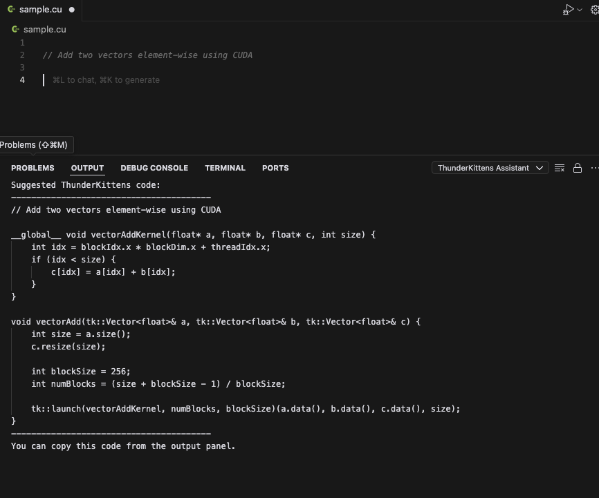

## ThunderKittens Assistant

This extension provides an AI-powered code assistant, what it basically does right now is it lets you select a piece of code and ask questions about it. The nice thing is you can provide a long prompt of your library is intentended to be used at the top of `extension.ts` and then will just use Claude to provide suggestions.

Whilee this code can work with any arbitrary library, for this repo I'm showing how it's meant to be used with the ThunderKittens CUDA library.


## Setup

```bash
npm install
npm run compile
```

Then with `extensions.ts` open, type `F5` to open a new VSCode window with this extension loaded. I can look into publishing something like this if it becomes of interest.


## Usage

Command palette is typically `Ctrl+Shift+P` or `Cmd+Shift+P`

* Set your anthropic API key just once using Command Palette: `ThunderKittens: Set API Key`
* Get examples of how to use the ThunderKittens API using Command Palette: `ThunderKittens: Get API Help`


## Example

Ask about how to run an elementwise addition of two vectors:



## Next steps

* [ ] Publish the extension so people can install it without having to compile it themselves
* [ ] Add code suggestions in the editor directly
* [ ] Play around with the prompt a bit more